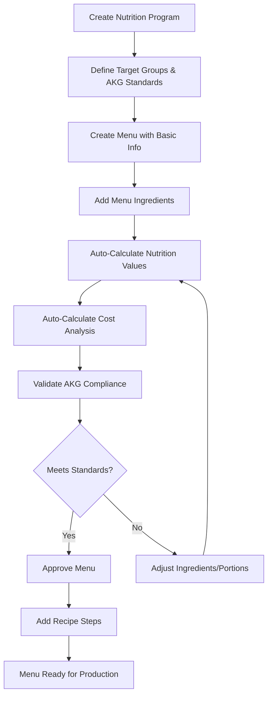
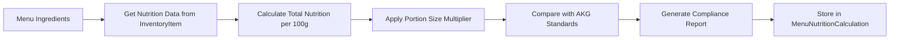
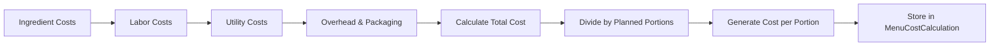

# 🍽️ Domain Menu - Workflow & Development Documentation
**Bagizi-ID SaaS Platform - Menu Management System**

---

## 📊 **Executive Summary**

Domain Menu merupakan inti dari sistem SPPG yang menghubungkan perencanaan nutrisi dengan manajemen biaya operasional. Sistem ini memungkinkan SPPG untuk:

- ✅ **Menu Planning** - Perencanaan menu berbasis standar AKG
- ✅ **Nutrition Calculation** - Kalkulasi otomatis nilai gizi per menu
- ✅ **Cost Analysis** - Analisis biaya komprehensif per porsi
- ✅ **Recipe Management** - Manajemen resep dengan langkah detail
- ✅ **Compliance Monitoring** - Monitoring kepatuhan standar gizi

---

## 🏗️ **Database Schema Architecture**

### **Core Models Relationship:**
```
SPPG
├── NutritionProgram (Program Gizi per periode)
│   └── NutritionMenu (Menu dalam program)
│       ├── MenuIngredient (Bahan-bahan menu)
│       │   └── InventoryItem (Data nutrisi & harga bahan)
│       ├── MenuNutritionCalculation (Kalkulasi otomatis nilai gizi)
│       ├── MenuCostCalculation (Kalkulasi otomatis biaya)
│       └── RecipeStep (Langkah-langkah resep)
└── NutritionStandard (Standar AKG reference)
```

### **Single Source of Truth Pattern:**
- **Nutrition Data**: Hanya di `MenuNutritionCalculation` (calculated from ingredients)
- **Cost Data**: Hanya di `MenuCostCalculation` (calculated from ingredient costs + overhead)
- **Recipe Steps**: Terpisah di `RecipeStep` untuk fleksibilitas

---

## 🔄 **Business Process Workflow**

### **1. Menu Planning Flow**


### **2. Nutrition Calculation Engine**


### **3. Cost Calculation Engine**


---

## 📋 **Development Roadmap & Implementation Plan**

### **Phase 1: Core Menu Management (Week 1-2)**

#### **1.1 Database Setup & Models**
```bash
# Priority: HIGH | Effort: 2 days
```

**Tasks:**
- [ ] **Prisma Models Validation** - Verify schema relationships
- [ ] **Database Migration** - Apply schema changes
- [ ] **Seed Data Setup** - Create master data (categories, standards)

**Deliverables:**
- ✅ Working Prisma models with proper relationships
- ✅ Seed data for nutrition standards (AKG Indonesia)
- ✅ Inventory items with nutrition data sample

#### **1.2 API Endpoints Development**
```bash
# Priority: HIGH | Effort: 3 days
```

**API Structure:**
```
/api/sppg/menu/
├── GET,POST /                    # Menu list & creation
├── GET,PUT,DELETE /[id]         # Individual menu operations
├── POST /[id]/calculate-nutrition # Trigger nutrition calculation
├── POST /[id]/calculate-cost      # Trigger cost calculation
└── GET /[id]/compliance-report    # Nutrition compliance report

/api/sppg/menu/ingredients/
├── GET,POST /[menuId]           # Menu ingredients
└── PUT,DELETE /[ingredientId]   # Individual ingredient ops

/api/sppg/menu/recipe/
└── GET,POST,PUT /[menuId]/steps # Recipe steps management
```

**Implementation Pattern:**
```typescript
// src/app/api/sppg/menu/route.ts
export async function POST(request: NextRequest) {
  // 1. Authentication & SPPG access check
  const session = await auth()
  if (!session?.user.sppgId) return unauthorizedResponse()
  
  // 2. Validation with Zod schemas
  const validated = createMenuSchema.safeParse(body)
  if (!validated.success) return validationError(validated.error)
  
  // 3. Multi-tenant data creation
  const menu = await prisma.nutritionMenu.create({
    data: {
      ...validated.data,
      program: {
        connect: { 
          id: programId,
          sppgId: session.user.sppgId // Multi-tenant safety
        }
      }
    }
  })
  
  return successResponse(menu)
}
```

### **Phase 2: Nutrition Calculation Engine (Week 2-3)**

#### **2.1 Nutrition Calculation Service**
```bash
# Priority: HIGH | Effort: 4 days
```

**Service Architecture:**
```typescript
// src/domains/menu/services/NutritionCalculationService.ts
export class NutritionCalculationService {
  async calculateMenuNutrition(menuId: string): Promise<NutritionResult> {
    // 1. Get menu ingredients with inventory nutrition data
    const ingredients = await this.getMenuIngredientsWithNutrition(menuId)
    
    // 2. Calculate total nutrition per ingredient
    const nutritionTotals = ingredients.map(ingredient => ({
      calories: (ingredient.quantity / 100) * ingredient.inventoryItem.calories,
      protein: (ingredient.quantity / 100) * ingredient.inventoryItem.protein,
      // ... other nutrients
    }))
    
    // 3. Sum all nutrition values
    const totalNutrition = this.sumNutritionValues(nutritionTotals)
    
    // 4. Compare with AKG standards
    const akgCompliance = await this.checkAKGCompliance(totalNutrition, targetGroup)
    
    // 5. Store calculation results
    return await this.storeNutritionCalculation(menuId, totalNutrition, akgCompliance)
  }
  
  private async checkAKGCompliance(nutrition: Nutrition, targetGroup: string) {
    const standard = await this.getNutritionStandard(targetGroup)
    
    return {
      meetsCalorieAKG: nutrition.calories >= standard.calories * 0.8, // 80% minimum
      meetsProteinAKG: nutrition.protein >= standard.protein * 0.8,
      meetsAKG: this.calculateOverallCompliance(nutrition, standard),
      deficientNutrients: this.findDeficientNutrients(nutrition, standard),
      excessNutrients: this.findExcessNutrients(nutrition, standard)
    }
  }
}
```

#### **2.2 Real-time Nutrition Updates**
```bash
# Priority: MEDIUM | Effort: 2 days  
```

**Auto-calculation Triggers:**
- ✅ When ingredient quantity changes
- ✅ When new ingredient added/removed
- ✅ When serving size modified
- ✅ When inventory nutrition data updated

### **Phase 3: Cost Calculation Engine (Week 3-4)**

#### **3.1 Cost Calculation Service**
```bash
# Priority: HIGH | Effort: 4 days
```

**Service Implementation:**
```typescript
// src/domains/menu/services/CostCalculationService.ts
export class CostCalculationService {
  async calculateMenuCost(menuId: string): Promise<CostResult> {
    // 1. Calculate ingredient costs
    const ingredientCosts = await this.calculateIngredientCosts(menuId)
    
    // 2. Calculate labor costs
    const laborCosts = await this.calculateLaborCosts(menuId)
    
    // 3. Calculate utility costs (gas, electricity, water)
    const utilityCosts = await this.calculateUtilityCosts(menuId)
    
    // 4. Calculate overhead costs (15% default)
    const overheadCosts = this.calculateOverheadCosts(ingredientCosts, laborCosts, utilityCosts)
    
    // 5. Calculate total cost per portion
    const totalCost = ingredientCosts + laborCosts + utilityCosts + overheadCosts
    const costPerPortion = totalCost / plannedPortions
    
    // 6. Generate cost analysis & optimization suggestions
    const analysis = this.generateCostAnalysis(costBreakdown)
    
    return await this.storeCostCalculation(menuId, costBreakdown, analysis)
  }
  
  private generateCostAnalysis(costs: CostBreakdown): CostAnalysis {
    return {
      ingredientCostRatio: costs.ingredients / costs.total * 100,
      laborCostRatio: costs.labor / costs.total * 100,
      overheadCostRatio: costs.overhead / costs.total * 100,
      costOptimizations: this.suggestCostOptimizations(costs),
      alternativeIngredients: this.suggestAlternatives(costs.ingredients)
    }
  }
}
```

#### **3.2 Cost Optimization Engine**
```bash
# Priority: MEDIUM | Effort: 3 days
```

**Features:**
- ✅ **Alternative Ingredient Suggestions** - Cheaper alternatives with similar nutrition
- ✅ **Batch Size Optimization** - Optimal cooking batch for cost efficiency  
- ✅ **Seasonal Price Adjustments** - Dynamic cost calculation based on market prices
- ✅ **Supplier Comparison** - Multi-supplier cost analysis

### **Phase 4: Menu Management UI (Week 4-5)**

#### **4.1 Menu Creation & Management Components**
```bash
# Priority: HIGH | Effort: 5 days
```

**Component Structure:**
```
src/features/sppg/menu/
├── components/
│   ├── MenuForm.tsx               # Create/Edit menu form
│   ├── MenuCard.tsx               # Menu display card
│   ├── MenuTable.tsx              # Menu list with filters
│   ├── IngredientManager.tsx      # Add/edit ingredients
│   ├── NutritionSummary.tsx       # Nutrition facts display
│   ├── CostAnalysis.tsx           # Cost breakdown display
│   ├── ComplianceIndicator.tsx    # AKG compliance status
│   └── RecipeStepsEditor.tsx      # Recipe steps management
├── hooks/
│   ├── useMenus.tsx               # Menu CRUD operations
│   ├── useNutritionCalculation.tsx # Nutrition calculations
│   ├── useCostCalculation.tsx      # Cost calculations
│   └── useIngredients.tsx         # Ingredient management
└── schemas/
    ├── menuSchema.ts              # Menu validation
    ├── ingredientSchema.ts        # Ingredient validation
    └── recipeSchema.ts            # Recipe validation
```

**Key Components Implementation:**

```typescript
// MenuForm.tsx - Enterprise-grade form with validation
export function MenuForm({ programId, menuId }: MenuFormProps) {
  const form = useForm<MenuInput>({
    resolver: zodResolver(menuSchema),
    defaultValues: {
      programId,
      mealType: 'SNACK',
      servingSize: 200,
      isActive: true
    }
  })
  
  return (
    <Form {...form}>
      <form onSubmit={form.handleSubmit(onSubmit)}>
        {/* Basic menu information */}
        <MenuBasicInfoSection />
        
        {/* Ingredient management */}
        <IngredientManagerSection menuId={menuId} />
        
        {/* Real-time nutrition & cost display */}
        <NutritionCostSummary menuId={menuId} />
        
        {/* Recipe steps */}
        <RecipeStepsSection menuId={menuId} />
        
        {/* Compliance indicators */}
        <ComplianceSection menuId={menuId} />
      </form>
    </Form>
  )
}
```

#### **4.2 Real-time Calculation Displays**
```bash
# Priority: HIGH | Effort: 3 days
```

**Features:**
- ✅ **Live Nutrition Updates** - Real-time nutrition calculation as ingredients change
- ✅ **Cost Tracking** - Live cost updates with ingredient price changes
- ✅ **AKG Compliance Meter** - Visual compliance indicators
- ✅ **Optimization Suggestions** - AI-powered cost & nutrition optimization

### **Phase 5: Advanced Features (Week 5-6)**

#### **5.1 Menu Planning & Scheduling**
```bash
# Priority: MEDIUM | Effort: 4 days
```

**Features:**
- ✅ **Weekly Menu Planning** - Plan menus for entire week/month
- ✅ **Menu Rotation** - Automatic menu rotation for variety
- ✅ **Seasonal Adjustments** - Seasonal ingredient availability
- ✅ **Bulk Operations** - Batch menu creation and modification

#### **5.2 Reporting & Analytics**
```bash
# Priority: MEDIUM | Effort: 3 days
```

**Reports:**
- ✅ **Nutrition Compliance Report** - AKG compliance tracking over time
- ✅ **Cost Analysis Report** - Cost trends and optimization opportunities
- ✅ **Menu Performance Report** - Most popular/profitable menus
- ✅ **Ingredient Usage Report** - Ingredient consumption patterns

---

## 🛠️ **Technical Implementation Guidelines**

### **1. Schema Validation with Zod**

```typescript
// src/features/sppg/menu/schemas/menuSchema.ts
export const menuSchema = z.object({
  programId: z.string().cuid(),
  menuName: z.string().min(3, 'Nama menu minimal 3 karakter'),
  menuCode: z.string().min(2, 'Kode menu minimal 2 karakter'),
  mealType: z.nativeEnum(MealType),
  servingSize: z.number().min(50).max(1000),
  description: z.string().optional(),
  
  // Cost & pricing
  costPerServing: z.number().min(0).optional(),
  sellingPrice: z.number().min(0).optional(),
  
  // Recipe information
  cookingTime: z.number().min(0).optional(),
  preparationTime: z.number().min(0).optional(),
  difficulty: z.enum(['EASY', 'MEDIUM', 'HARD']).optional(),
  
  // Allergens & dietary info
  allergens: z.array(z.string()).optional(),
  isHalal: z.boolean().default(true),
  isVegetarian: z.boolean().default(false),
  
  isActive: z.boolean().default(true)
})

export const ingredientSchema = z.object({
  menuId: z.string().cuid(),
  inventoryItemId: z.string().cuid().optional(),
  ingredientName: z.string().min(2),
  quantity: z.number().min(0.1),
  unit: z.string().min(1),
  costPerUnit: z.number().min(0),
  preparationNotes: z.string().optional(),
  isOptional: z.boolean().default(false)
})
```

### **2. Enterprise Service Layer Pattern**

```typescript
// src/domains/menu/services/MenuService.ts
export class MenuService {
  constructor(
    private nutritionCalcService: NutritionCalculationService,
    private costCalcService: CostCalculationService,
    private complianceService: ComplianceService
  ) {}
  
  async createMenuWithCalculations(input: MenuInput, sppgId: string): Promise<MenuResult> {
    // 1. Create base menu
    const menu = await this.createMenu(input, sppgId)
    
    // 2. Add ingredients if provided
    if (input.ingredients?.length) {
      await this.addIngredients(menu.id, input.ingredients)
      
      // 3. Auto-calculate nutrition & cost
      await Promise.all([
        this.nutritionCalcService.calculateMenuNutrition(menu.id),
        this.costCalcService.calculateMenuCost(menu.id)
      ])
    }
    
    return menu
  }
  
  async updateMenuIngredient(ingredientId: string, update: IngredientUpdate): Promise<void> {
    // 1. Update ingredient
    await this.updateIngredient(ingredientId, update)
    
    // 2. Trigger recalculations
    const ingredient = await this.getIngredientWithMenu(ingredientId)
    await Promise.all([
      this.nutritionCalcService.calculateMenuNutrition(ingredient.menuId),
      this.costCalcService.calculateMenuCost(ingredient.menuId)
    ])
  }
}
```

### **3. Real-time Updates with TanStack Query**

```typescript
// src/features/sppg/menu/hooks/useMenuCalculations.ts
export function useMenuCalculations(menuId: string) {
  const queryClient = useQueryClient()
  
  // Nutrition calculation
  const { data: nutritionCalc, refetch: refetchNutrition } = useQuery({
    queryKey: ['menu-nutrition', menuId],
    queryFn: () => menuApi.getNutritionCalculation(menuId),
    enabled: !!menuId
  })
  
  // Cost calculation  
  const { data: costCalc, refetch: refetchCost } = useQuery({
    queryKey: ['menu-cost', menuId],
    queryFn: () => menuApi.getCostCalculation(menuId),
    enabled: !!menuId
  })
  
  // Trigger recalculation
  const { mutate: recalculate } = useMutation({
    mutationFn: () => menuApi.recalculateMenu(menuId),
    onSuccess: () => {
      // Invalidate both calculations
      queryClient.invalidateQueries({ queryKey: ['menu-nutrition', menuId] })
      queryClient.invalidateQueries({ queryKey: ['menu-cost', menuId] })
    }
  })
  
  return {
    nutritionCalc,
    costCalc,
    recalculate,
    isCalculating: false // TODO: implement loading states
  }
}
```

---

## 📊 **Success Metrics & KPIs**

### **Technical Metrics:**
- ✅ **API Performance**: <200ms average response time
- ✅ **Calculation Accuracy**: 100% nutrition calculation accuracy
- ✅ **Data Consistency**: Zero data inconsistencies between models
- ✅ **Test Coverage**: >90% test coverage for business logic

### **Business Metrics:**
- ✅ **Menu Creation Time**: <5 minutes per complete menu
- ✅ **AKG Compliance Rate**: >95% menu compliance with standards
- ✅ **Cost Optimization**: 10-15% cost reduction through optimization
- ✅ **User Satisfaction**: >4.5/5 usability rating

### **Operational Metrics:**
- ✅ **Menu Planning Efficiency**: 50% faster menu planning
- ✅ **Nutritionist Productivity**: 3x more menus validated per day
- ✅ **Cost Control**: Real-time cost visibility and control
- ✅ **Compliance Monitoring**: 100% automated compliance checking

---

## 🚀 **Deployment & Production Readiness**

### **Pre-Production Checklist:**
- [ ] **Database Performance**: Proper indexing for menu queries
- [ ] **API Rate Limiting**: Protect calculation endpoints
- [ ] **Caching Strategy**: Cache frequent calculations
- [ ] **Error Handling**: Comprehensive error scenarios
- [ ] **Audit Logging**: All menu changes logged
- [ ] **Backup Strategy**: Regular calculation data backups

### **Production Monitoring:**
- [ ] **Performance Monitoring**: Track calculation performance
- [ ] **Business Metrics**: Monitor menu creation patterns
- [ ] **Error Tracking**: Real-time error alerting
- [ ] **Usage Analytics**: Feature usage patterns

---

## 🎯 **Next Steps & Future Enhancements**

### **Phase 6: AI-Powered Features (Future)**
- 🔮 **AI Menu Optimization** - ML-powered ingredient optimization
- 🔮 **Predictive Costing** - Price prediction based on market trends
- 🔮 **Smart Substitutions** - AI ingredient substitution suggestions
- 🔮 **Nutrition AI** - Advanced nutrition optimization algorithms

### **Phase 7: Integration Expansion (Future)**
- 🔮 **Supplier Integration** - Real-time price feeds
- 🔮 **Market Price APIs** - Dynamic pricing based on market data
- 🔮 **Nutrition Database Integration** - External nutrition databases
- 🔮 **Government Compliance APIs** - Auto-sync with regulation updates

---

**Domain Menu merupakan foundation dari seluruh operasi SPPG, menghubungkan perencanaan strategis dengan operasional harian melalui sistem yang terintegrasi, akurat, dan mudah digunakan.** 

**Target: Production-ready menu management system dengan real-time calculation capabilities dalam 6 minggu.**