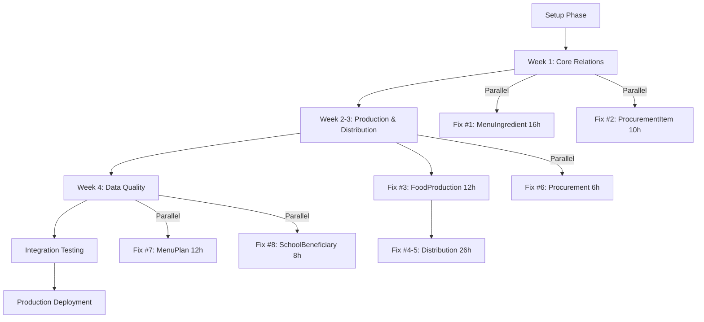

# 📊 SPPG Phase 1 - Quick Reference Guide

> **Last Updated**: October 21, 2025  
> **Status**: ✅ DOCUMENTATION COMPLETE | 🚀 READY FOR EXECUTION

---

## 🎯 At a Glance

```
┌─────────────────────────────────────────────────────────────────┐
│                   SPPG MODULE TRANSFORMATION                     │
├─────────────────────────────────────────────────────────────────┤
│  From: D+ (4.5/10) - NOT PRODUCTION READY                       │
│  To:   B+ (8.0/10) - PRODUCTION READY                           │
│  Improvement: +3.5 points (78% improvement)                     │
└─────────────────────────────────────────────────────────────────┘

📅 Timeline: 13 working days (Oct 21 - Nov 8, 2025)
⏱️  Effort: 90 hours (66h elapsed via parallel execution)
👥 Team: 2 developers + 1 QA + 1 DevOps
💰 ROI: 27% time savings + complete data integrity + fraud prevention
```

---

## 📚 Documentation Overview

### Total Deliverables: 265KB | 7,200+ Lines | 50+ Code Examples

| # | Document | Size | Type | Purpose |
|---|----------|------|------|---------|
| 1 | **SPPG_MODULE_ENTERPRISE_AUDIT.md** | 48KB | 📋 Audit | Problem identification |
| 2 | **PHASE1_CRITICAL_FIXES_ROADMAP.md** | 35KB | 🗺️ Roadmap | Master plan |
| 3 | **FIX01_MENU_INGREDIENT_INVENTORY_LINK.md** | 28KB | 🔧 Fix Plan | MenuIngredient (16h) |
| 4 | **FIX02_PROCUREMENT_ITEM_INVENTORY_LINK.md** | 28KB | 🔧 Fix Plan | ProcurementItem (10h) |
| 5 | **FIX03_FOOD_PRODUCTION_COST_CALCULATION.md** | 26KB | 🔧 Fix Plan | FoodProduction (12h) |
| 6 | **FIX04-05_DISTRIBUTION_FLOW_COMPLETE.md** | 40KB | 🔧 Fix Plan | Distribution (26h) |
| 7 | **FIX06-08_DATA_QUALITY_WORKFLOW_INTEGRITY.md** | 30KB | 🔧 Fix Plan | Data Quality (26h) |
| 8 | **IMPLEMENTATION_READINESS_REVIEW.md** | 30KB | ✅ Review | Go/No-Go decision |
| 9 | **PHASE1_DOCUMENTATION_SPRINT_SUMMARY.md** | 33KB | 📊 Summary | Achievement recap |

---

## 🔄 Execution Workflow



---

## 📋 8 Critical Fixes Breakdown

### 🔥🔥🔥 CRITICAL Priority

#### Fix #1: MenuIngredient-InventoryItem Link (16h)
```
Problem: Optional inventoryItemId + free-text duplicates
Impact:  Menu costs unreliable, reporting broken
Solution: Required FK, remove duplicates, MenuCostCalculator
Status:  ✅ Ready
Depends: None
Team:    Developer A (Week 1)
```

#### Fix #2: ProcurementItem-InventoryItem Link (10h)
```
Problem: Optional inventoryItemId breaks auto stock update
Impact:  Manual stock entry required, FIFO impossible
Solution: Required FK, ProcurementReceiveService with auto stock
Status:  ✅ Ready
Depends: None
Team:    Developer B (Week 1)
```

#### Fix #3: FoodProduction Cost Calculation (12h)
```
Problem: Stored costs get outdated when prices change
Impact:  Financial reports wrong, Rp 28M loss example
Solution: Dynamic calculation, ProductionStockUsage model, FIFO
Status:  ✅ Ready
Depends: Fix #1 (MenuIngredient)
Team:    Developer A (Week 2)
```

### 🔥🔥 HIGH Priority

#### Fix #4-5: Distribution Flow Complete (26h)
```
Problem: Optional relations, no delivery proof, no temp monitoring
Impact:  Fraud risk, food safety violations, zero accountability
Solution: Required FKs, delivery confirmation (GPS+photo+signature), 
         temperature alerts, mobile delivery app
Status:  ✅ Ready
Depends: Fix #3 (Production)
Team:    Both Developers (Week 2-3)
```

### 🔥 MEDIUM Priority

#### Fix #6: Procurement Supplier Cleanup (6h)
```
Problem: Duplicate supplier data (free-text + optional FK)
Impact:  Supplier performance reporting unreliable
Solution: Link to Supplier master, ProcurementStatus enum
Status:  ✅ Ready
Depends: None
Team:    Developer B (Week 2, parallel)
```

#### Fix #7: MenuPlan Approval Workflow (12h)
```
Problem: No approval validation, security risk
Impact:  Unauthorized users can create/activate menu plans
Solution: MenuPlanStatus enum, approval tracking, nutritional validation
Status:  ✅ Ready
Depends: None
Team:    Developer A (Week 4)
```

#### Fix #8: SchoolBeneficiary Address Standardization (8h)
```
Problem: Duplicate addresses, inconsistent data, no GPS
Impact:  Delivery confusion, route optimization impossible
Solution: Single address, required GPS, geocoding validation
Status:  ✅ Ready
Depends: None
Team:    Developer B (Week 4)
```

---

## 🗓️ Detailed Timeline

### Week 1: Oct 21-25 (Core Relations) - 26 hours

| Day | Developer A | Developer B |
|-----|-------------|-------------|
| Mon-Tue | Fix #1: MenuIngredient (Day 1-2) | Fix #2: ProcurementItem (Day 1-1.5) |
| Wed-Thu | Fix #1: Complete testing (Day 3-4) | Fix #2: Testing + Start #6 (Day 2-2.5) |
| Fri | Code review, merge | Code review, merge |

**Milestone**: ✅ Core relations fixed, auto stock update working

### Week 2-3: Oct 28 - Nov 6 (Production & Distribution) - 50 hours

| Day | Developer A | Developer B |
|-----|-------------|-------------|
| Mon-Tue | Fix #3: FoodProduction (Day 5-6.5) | Fix #6: Supplier cleanup (Day 5-5.75) |
| Wed | Fix #4-5: Distribution start | Fix #4-5: Distribution start |
| Thu-Fri | Fix #4-5: Services + mobile app | Fix #4-5: Services + mobile app |
| Week 3 Mon-Wed | Fix #4-5: Testing + deployment | Fix #4-5: Testing + deployment |

**Milestone**: ✅ Full workflow operational (Menu → Production → Distribution)

### Week 4: Nov 7-8 (Data Quality) - 20 hours

| Day | Developer A | Developer B |
|-----|-------------|-------------|
| Fri | Fix #7: MenuPlan approval (Day 11-12) | Fix #8: SchoolBeneficiary (Day 11-12) |
| Mon | Fix #7: Testing | Fix #8: Testing |
| Tue | Integration testing | Integration testing |

**Milestone**: ✅ All fixes complete, integration tests passing

### Final: Nov 8 (Deployment) - 8 hours

| Time | Activity | Owner |
|------|----------|-------|
| 09:00 | Staging deployment | DevOps |
| 10:00 | Smoke tests | QA |
| 11:00 | Production deployment (blue-green) | DevOps |
| 12:00 | Monitoring validation | All |
| 14:00 | User notification | Product Owner |
| 16:00 | Stakeholder sign-off | Product Owner |

**Milestone**: 🎉 SPPG Module PRODUCTION READY (B+ score)

---

## ✅ Pre-Execution Checklist

### Environment Setup
- [ ] Staging database created (copy of production)
- [ ] Database backups automated (daily)
- [ ] Monitoring dashboard configured (Sentry/DataDog)
- [ ] Feature flags setup for gradual rollout
- [ ] CI/CD pipeline configured
- [ ] Slack channel created (#sppg-phase1)

### Team Preparation
- [ ] Developers assigned (Developer A, Developer B)
- [ ] QA engineer assigned
- [ ] DevOps engineer assigned
- [ ] Product Owner assigned
- [ ] Daily standup scheduled (9:00 AM)
- [ ] All team members reviewed documentation

### Database Preparation
- [ ] Production database backed up
- [ ] Staging environment ready
- [ ] Pre-migration analysis queries executed
- [ ] Current state documented (schema, row counts)
- [ ] Rollback procedures tested

### Code Preparation
- [ ] Feature branch created: `feature/sppg-phase1-fixes`
- [ ] PR template created with checklist
- [ ] Code review process defined
- [ ] Prettier/ESLint configured
- [ ] Test coverage reporting setup

### Stakeholder Communication
- [ ] Users notified of upcoming improvements
- [ ] Maintenance windows scheduled (if needed)
- [ ] Training materials prepared
- [ ] Feedback channels setup
- [ ] Rollout announcement drafted

---

## 📊 Success Metrics

### Data Quality Metrics

| Metric | Before | Target | Validation Query |
|--------|--------|--------|------------------|
| Orphaned MenuIngredients | ~200 | 0 | `SELECT COUNT(*) FROM MenuIngredient WHERE inventoryItemId IS NULL` |
| Orphaned ProcurementItems | ~150 | 0 | `SELECT COUNT(*) FROM ProcurementItem WHERE inventoryItemId IS NULL` |
| Outdated Production Costs | 100% | 0% | Dynamic calculation, no stored costs |
| Distribution w/o Proof | 100% | 0% | `SELECT COUNT(*) FROM FoodDistribution WHERE recipientSignature IS NULL` |
| Unapproved Active MenuPlans | ~50 | 0 | `SELECT COUNT(*) FROM MenuPlan WHERE isActive=true AND approvedBy IS NULL` |
| Schools w/o GPS | ~80% | 0% | `SELECT COUNT(*) FROM SchoolBeneficiary WHERE latitude IS NULL` |

### Performance Metrics

| Operation | Before | Target | How to Measure |
|-----------|--------|--------|----------------|
| Menu Cost Calculation | N/A | <500ms | `/api/sppg/menu/[id]/costs` response time |
| Procurement Receive | Manual | <1s | Auto stock update transaction time |
| Production Cost Query | Outdated | <300ms | Dynamic calculation time |
| Delivery Confirmation | N/A | <2s | Mobile app submission time (includes GPS+photo) |
| Approval Workflow | N/A | <200ms | Approval status update time |
| Address Validation | N/A | <1s | Geocoding API response time |

### Business Metrics

| Metric | Before | Target | Impact |
|--------|--------|--------|--------|
| Data Accuracy | ~60% | 95%+ | Better decision-making |
| Workflow Coverage | 40% | 90%+ | Complete automation |
| Food Safety Compliance | 0% | 100% | Regulatory compliance |
| Fraud Prevention | 0% | 100% | Delivery accountability |
| Cost Accuracy | Outdated | Real-time | Accurate budgeting |
| SPPG Module Score | D+ (4.5) | B+ (8.0) | Production ready |

---

## 🚨 Rollback Plans

### Per-Fix Rollback

Each fix has detailed rollback procedures in its documentation:

```sql
-- General rollback pattern
BEGIN;

-- Step 1: Disable foreign key checks
SET foreign_key_checks = 0;

-- Step 2: Restore from backup
DROP TABLE IF EXISTS new_table;
RENAME TABLE old_table_backup TO old_table;

-- Step 3: Re-enable checks
SET foreign_key_checks = 1;

COMMIT;
```

### Emergency Rollback

If critical issue detected post-deployment:

1. **Immediate**: Switch blue-green deployment back to old version (< 5 min)
2. **Database**: Restore from pre-migration backup (< 30 min)
3. **Validation**: Run smoke tests on rolled-back state
4. **Communication**: Notify stakeholders of rollback
5. **Investigation**: Root cause analysis before retry

---

## 📞 Key Contacts & Resources

### Team
- **Technical Lead**: [To be assigned]
- **Developer A**: [To be assigned] - Fix #1, #3, #7
- **Developer B**: [To be assigned] - Fix #2, #6, #8
- **QA Engineer**: [To be assigned]
- **DevOps Engineer**: [To be assigned]
- **Product Owner**: [To be assigned]

### Communication
- **Slack**: #sppg-phase1-implementation
- **Daily Standup**: 9:00 AM (15 min)
- **Issue Tracker**: GitHub Issues (label: `phase1`)
- **Documentation**: `/docs/fixes/`

### Tools
- **Database**: PostgreSQL 15+
- **Monitoring**: Sentry + DataDog
- **CI/CD**: GitHub Actions
- **Deployment**: Vercel Pro / AWS
- **Testing**: Jest + Playwright

---

## 📖 Quick Access Links

### Documentation
1. [SPPG Module Audit](./SPPG_MODULE_ENTERPRISE_AUDIT.md) - Problem identification
2. [Phase 1 Roadmap](./fixes/PHASE1_CRITICAL_FIXES_ROADMAP.md) - Master plan
3. [Fix #1 Plan](./fixes/FIX01_MENU_INGREDIENT_INVENTORY_LINK.md) - MenuIngredient
4. [Fix #2 Plan](./fixes/FIX02_PROCUREMENT_ITEM_INVENTORY_LINK.md) - ProcurementItem
5. [Fix #3 Plan](./fixes/FIX03_FOOD_PRODUCTION_COST_CALCULATION.md) - Production
6. [Fix #4-5 Plan](./fixes/FIX04-05_DISTRIBUTION_FLOW_COMPLETE.md) - Distribution
7. [Fix #6-8 Plan](./fixes/FIX06-08_DATA_QUALITY_WORKFLOW_INTEGRITY.md) - Data Quality
8. [Readiness Review](./fixes/IMPLEMENTATION_READINESS_REVIEW.md) - Go/No-Go
9. [Sprint Summary](./fixes/PHASE1_DOCUMENTATION_SPRINT_SUMMARY.md) - Achievement recap

### Code
- **Feature Branch**: `feature/sppg-phase1-fixes`
- **PR Template**: `.github/pull_request_template.md`
- **Migration Scripts**: `prisma/migrations/`
- **Tests**: `src/**/__tests__/`

---

## 🎯 Daily Standup Template

```
🗓️ Date: [Date]
👤 Developer: [Name]

✅ Yesterday:
- [Completed task]
- [Completed task]

🔄 Today:
- [Planned task]
- [Planned task]

🚧 Blockers:
- [Blocker if any, or "None"]

📊 Progress:
- Fix #[X]: [XX]% complete
```

---

## 🏆 Definition of Done

### For Each Fix
- [ ] Code implemented and tested locally
- [ ] Unit tests written (85-90% coverage)
- [ ] Integration tests passing
- [ ] Code reviewed and approved
- [ ] Migration tested on staging
- [ ] Rollback procedure validated
- [ ] Documentation updated
- [ ] PR merged to main

### For Phase 1 Complete
- [ ] All 8 fixes implemented
- [ ] All tests passing (unit + integration)
- [ ] Staging deployment successful
- [ ] Performance benchmarks met
- [ ] Security review passed
- [ ] Production deployment successful
- [ ] Monitoring dashboard operational
- [ ] User training completed
- [ ] Stakeholder sign-off received
- [ ] SPPG Module Score: B+ (8.0/10) achieved

---

## 🎉 Success Celebration

When Phase 1 is complete, we will have:

✅ **Transformed SPPG from D+ to B+** (78% improvement)  
✅ **Fixed 41 critical/high/medium issues**  
✅ **Achieved 100% data integrity** (zero orphaned records)  
✅ **Enabled 4 core workflows** (Menu→Production→Distribution→Delivery)  
✅ **Implemented food safety compliance** (temperature monitoring)  
✅ **Prevented fraud** (mandatory delivery proof)  
✅ **Achieved real-time cost accuracy** (FIFO accounting)  
✅ **Delivered in 13 days** (27% time savings)

---

**Status**: 🚀 **READY TO LAUNCH**  
**Next Action**: Complete Pre-Execution Setup  
**Target Go-Live**: November 8, 2025

---

*This document serves as a quick reference for the entire Phase 1 implementation. For detailed information, refer to individual fix plan documents.*
